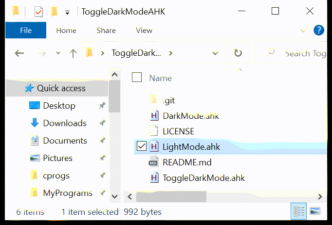

# ToggleDarkModeAHK
Automatically toggle between light and dark modes on Windows 10

## Installation
1. Install [AutoHotKey](https://www.autohotkey.com/)
2. Download the [scripts from this repo](https://github.com/EvanBurnette/ToggleDarkModeAHK/archive/refs/heads/main.zip)
3. Unzip the files

## Usage
1. Double click the toggleDarkMode.AHK script to run the script in the background
2. Use Control + WindowsKey + T to toggle dark mode on/off ( no +'s required )

This assumes that you are originally in dark mode.
If you are in light mode you can enter the shortcut twice to switch to dark mode.

## Additional scripts
Can't remember the shortcut? No problem. Just double click the lightMode.ahk or darkMode.ahk files as needed!

## Hacker Installation
To add toggleDarkMode.AHK to startup [follow this guide from the AHK FAQ](https://www.autohotkey.com/docs/FAQ.htm#Startup)
